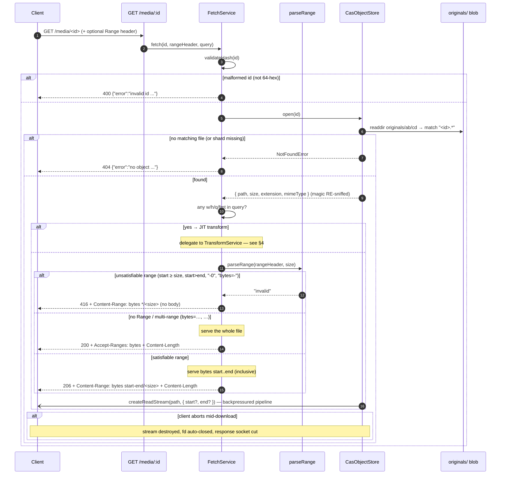

## 3. Download sequence (M2)

`GET /media/{id}` serves the original blob and honours HTTP byte-ranges. The
body is a raw stream all the way to the socket — nothing is read into memory.

Range forms (`parseRange`, `src/domain/range.ts`) apply to **originals only** —
generated variants are served whole (200).

| Header | Meaning | Result |
| --- | --- | --- |
| `bytes=0-1023` | from byte 0 to byte 1023 (inclusive) | `{start:0, end:1023}` |
| `bytes=1024-` | from byte 1024 to end of file | `{start:1024, end:size-1}` |
| `bytes=-500` | the **last** 500 bytes | `{start:size-500, end:size-1}` |
| `bytes=0-1,2-3` | multi-range → **ignored**, serve whole file | `null` |
| `bytes=999999999999-` | start past end of file | `"invalid"` → **416** |
| end beyond EOF | over-long until EOF | end clamped to `size-1` (still 206) |

Download properties:

- **MIME from magic, not filename/extension** — `CasObjectStore.open` re-sniffs
  the first bytes of the stored file, so a renamed file still serves the right
  `Content-Type`.
- **Extension-agnostic lookup** — the shard directory is listed and matched by
  `"<id>."` prefix; the stored extension never matters.
- **Id validated before touching the filesystem** — `validateHash` gates every
  id at both route and store level (no path traversal possible).
- **Interrupted downloads resume** — the client re-issues a `Range`, or uses
  `curl -C -`; the server serves 206 windows and the client rejoins them.