## 7. Error shaping

Every failure mode and its HTTP consequence (one mapper, one place —
`src/http/error-mapper.ts`).

```mermaid
flowchart TD
    subgraph UP["Upload (POST /api/v1/upload)"]
        A["Upload attempt"] --> B{"What went wrong?"}
        B -->|"no file part / a text field / two files"| D["BadRequestError (400)"]
        B -->|"size > MAX_UPLOAD_SIZE_MB"| E["PayloadTooLargeError (413)"]
        B -->|"I/O, unknown"| F["unhandled → 500"]
        B -->|"nothing wrong"| G["200 {id, url}"]
    end

    subgraph DN["Download (GET /media/:id)"]
        A2["GET with bad id"] -->|"not 64-hex"| D2["BadRequestError (400)"]
        A3["GET with valid id"] -->|"no stored object"| D3["NotFoundError (404)"]
        A4["GET with Range"] -->|"unsatisfiable range"| D4["416 + Content-Range: bytes */size"]
        A4 -->|"abort mid-stream"| D5["stream destroyed, no error body"]
    end

    subgraph TR["Transform (…?w=&h=&q=&fmt=)"]
        T1["Transform request"] -->|"w/h/q/fmt invalid or fmt ∉ ALLOWED_FORMATS"| T2["BadRequestError (400)"]
        T1 -->|"original isn't a decodable image"| T2
        T1 -->|"worker queue saturated"| T3["ServiceUnavailableError (503) + Retry-After: 10"]
        T1 -->|"sharp I/O failure"| T4["unhandled → 500"]
        T1 -->|"clean"| T5["200 variant (cached on disk)"]
    end

    subgraph DL["Delete (DELETE /api/v1/media/:id)"]
        D6["Delete request"] -->|"malformed id (not 64-hex)"| D7["BadRequestError (400)"]
        D6 -->|"original gone / never existed / already deleted"| D8["204 no-op (idempotent)"]
        D6 -->|"clean"| D9["204 — original + variants purged"]
    end

    D --> M["error-mapper.ts"]
    E --> M
    F --> M
    D2 --> M
    D3 --> M
    T2 --> M
    T3 --> M
    T4 --> M
    D7 --> M

    M --> I["res.status(status).json({ error: message })"]
    M --> J["console.error + 500 — internals never leak"]
    M --> K["headersSent/destroyed → res.destroy() — never double-send"]
```

`AppError` carries `statusCode` (400/404/413/503) and the mapper is the **only**
place domain errors become HTTP responses. 416 is a *successful* response shaped
inside `FetchService`, not an error.