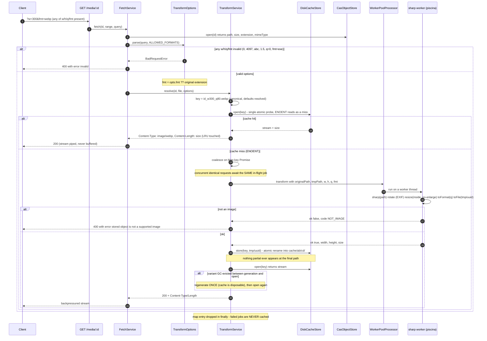

## 4. JIT transform sequence (M3)

`GET /media/{id}?w=300&h=200&q=80&fmt=webp` resolves a canonical cache key,
serves a hit, or coordinates **exactly one** generation job. The heavy lifting
happens in a worker thread; the main process only renames the result into the
cache and streams it.

Error back-channels:

- **Queue overload** — if `pool.queueSize >= maxQueue` the worker pre-check
  refuses immediately: **503 + `Retry-After: 10`** instead of queueing forever.
- **Heavy requests don't stall the event loop** — CPU work runs only in worker
  threads, so a 21s 4K avif encode coexists with a 7ms plain download (measured).

Transform properties:

- **Canonical key** — segment order is fixed (`w, h, q`) and defaults are
  resolved (`q` defaults to 80), so `?w=300&fmt=webp` and
  `?fmt=webp&w=300&q=80` name the same file; cache hits beat re-encoding.
- **sharp confined to the worker** — `sharp.cache(false)` + `concurrency(1)`
  pin libvips; the pool size is the parallelism control (thread × worker would
  otherwise explode RAM).
- **Variant extension/mime** — output format is the requested `fmt` (validated
  against `ALLOWED_FORMATS`) or the original's sniffed extension; `Content-Type`
  follows the output format, never the original.
- **Cache is disposable** — originals stay the source of truth; a deleted
  variant is regenerated on the next request.