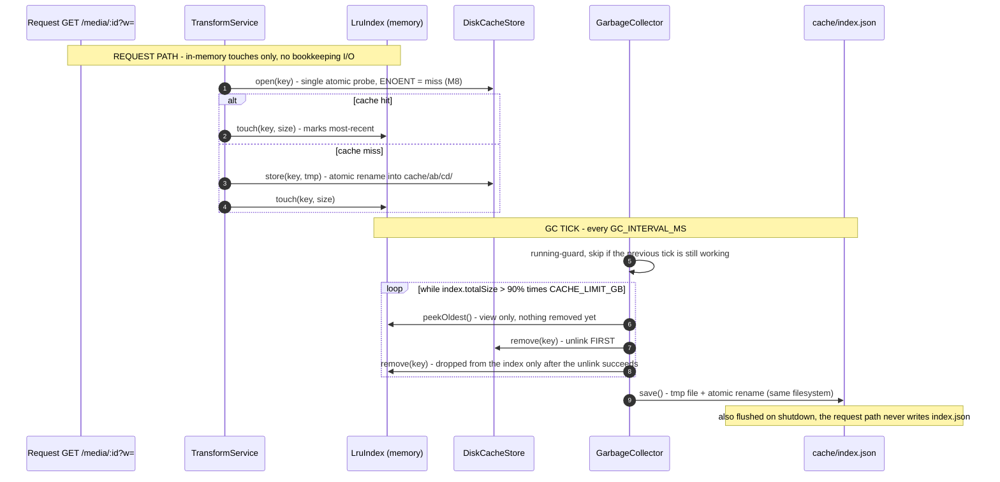

## 5. LRU bookkeeping + garbage collection (M4)

The variant cache is bounded by `CACHE_LIMIT_GB`. `LruIndex` keeps
`basename → { size, lastAccessedAt }` in memory; the `GarbageCollector` ticks
every `GC_INTERVAL_MS` and evicts the least-recently-used files until the index
sums to ≤ 90% of the limit.

Index lifecycle outside the tick:

- **Boot reconcile** (`main.ts`) — a process that dies between `store()`
  finishing and the next `index.save()` would otherwise drift: a stale-but-valid
  `index.json` loads fine and the new file is untracked, so GC under-counts and
  the cache grows past the limit every crash cycle. Boot therefore runs
  `mergeMissing(walk)`: any variant on disk that the index doesn't know gets
  absorbed (mtime = access time). Missing/corrupt `index.json` (→ `load()`
  throws) triggers a full `rebuild(walk)`.
- **Key validation** — every cache address passes through
  `DiskCacheStore.pathForBasename`, which rejects anything that isn't
  `<64-hex-id>_[whq…].<ext>`. A corrupt/hand-forged index key can never escape
  the `cache/` tree via `join()`.
- **Disposability preserved** — `index.json` is bookkeeping, not truth: a single
  atomic `open()` on disk decides hits/misses (ENOENT = miss, M8); a deleted
  index just means a rebuild. Evicted variants regenerate on the next request
  (originals are the source of truth).
- **Limit 0 = eviction disabled** — `CACHE_LIMIT_GB=0` short-circuits both the
  interval and `tick()`, so a tiny-for-testing or disabled cache never wipes.

Cache-layout hygiene:

- GC only ever scans/evicts `cache/ab/cd/` shard files — `index.json` and stray
  `.index-*.tmp` live at the `cache/` root and are structurally unreachable.
- **Unlink before index-remove**: if an `unlink` fails (e.g. EACCES/EPERM on a
  Windows open file) the entry stays indexed, so the byte count stays honest
  instead of the file becoming permanently un-evictable.
- Errors in the tick are logged, never propagated to a request — GC is
  best-effort bookkeeping by design.