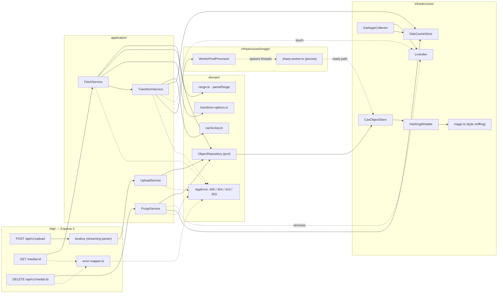

## 1. Layered architecture

Layers point inward: `http → application → domain`, and `infrastructure`
implements the domain interfaces. `domain` never imports express/busboy/fs;
**`sharp` is imported in exactly one module (the worker)** — never the main
thread.

- `FetchService` orchestrates: no options → original (range-aware); any option →
  `TransformService` → variant stream.
- `TransformService` validates nothing itself — `TransformOptions.parse` already
  threw 400 — it owns caching + coalescing + worker dispatch; on a hit and after
  storing a variant it refreshes `LruIndex` **in memory only** (the request path
  never pays for bookkeeping I/O).
- `GarbageCollector` ticks on an `unref()`'d interval: it persists the index,
  evicts least-recently-accessed variants down to 90% of `CACHE_LIMIT_GB`, then
  persists again. Bookkeeping only — it never touches originals or `tmp/`, and
  never prevents shutdown.
- `PurgeService` is pure orchestration (no fs): it unlinks the original via
  `ObjectRepository.delete` and removes every variant via `DiskCacheStore.listByPrefix`
  + `LruIndex`. Delete is idempotent — never a 404, only 204s.
- All error-to-HTTP translation is centralized in `error-mapper.ts`.