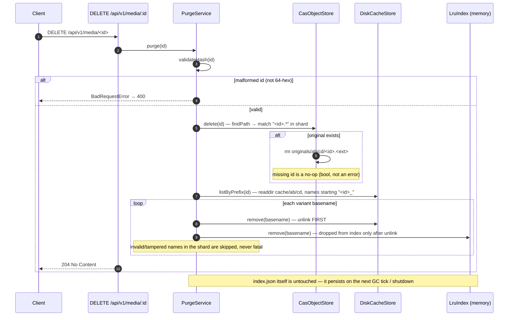

## 6. Purge sequence (M5)

`DELETE /api/v1/media/{id}` removes the original blob **and** every cached
variant derived from it. The plan mandates idempotence: deleting an id that is
already gone (or was never uploaded) is a **204 no-op**, not a 404 — only a
malformed id is a 400.

Purge properties:

- **One shard, all variants** — every variant of an id lives in the id's shard
  (`cache/ab/cd/`), so a single `readdir` covers the whole purge.
- **Unlink-before-index-remove** — same order as the GC, so a crash between the
  two leaves the file tracked (still evictable) instead of stranding a
  permanently untracked orphan.
- **Idempotent by design** — `CasObjectStore.delete` returns `false` for a
  missing file, `listByPrefix` returns `[]` for a missing shard, and `rm force`
  swallows races; a repeated DELETE is a clean 204 again.
- **Variants can't resurrect the original** — a transform request after a purge
  fails 404 at `objects.open`, and nothing ever writes back to `originals/`
  (only re-uploading identical bytes re-creates the id — correct CAS, not
  undelete).