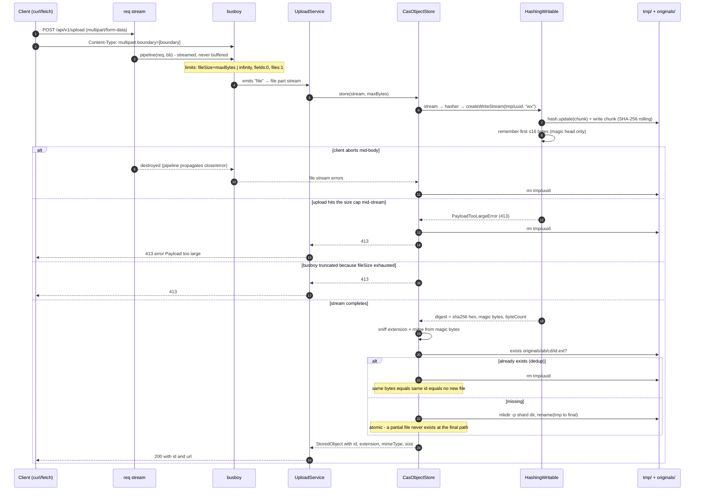

## 2. Upload sequence

The full lifecycle of a single `POST /api/v1/upload`:

Key properties demonstrated by the code:

- **Zero payload buffering** — bytes flow `req → busboy → HashingWritable → tmp`
  with backpressure; only a ≤16-byte magic head is kept.
- **Identity = SHA-256 of the content** — the id is `hasher.digest`, never a
  client-supplied filename.
- **Atomic writes** — temp file then `rename()`, so no partial file appears at
  a final path; every error/abort path removes the temp file.
- **Dedup by existence** — same bytes always produce the same path, so a second
  upload of identical content returns the same id and writes nothing.